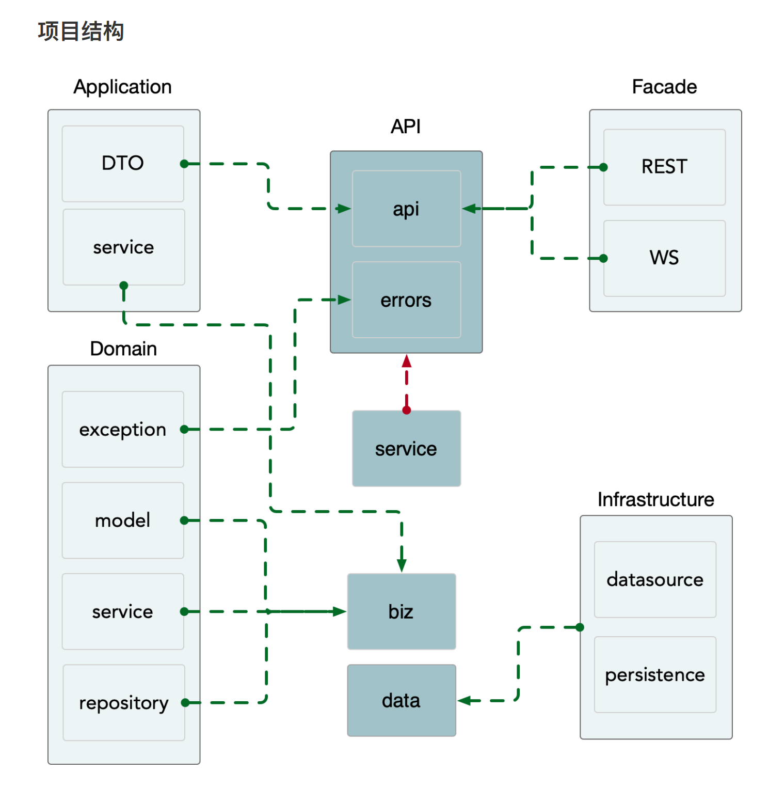

4.44 简单的写了一个post方法的调用
api层定义protobuf文件，定义http、grpc方法 
==> service层，实现api的功能，调用biz层
==> biz层实现业务逻辑
==> data层实现数据库的增删改查，持久化
==> server层，服务的装配、注册->api层

4.46
讲配置如何设置，通过conf.proto设置生成pb.go文件，
再在config.yaml中设置

4.47
讲解service->biz->data层crud操作的具体实现

4.48
讲解自定义HTTP响应编码器
默认响应编码器
get todo 1
{
 "code": 200,
 "msg": "success",
 "data"
}
get 所有todo
{
    "data": [
        {
            "id": "1",
            "title": "喝水",
            "status": false
        },
        {
            "id": "2",
            "title": "睡觉",
            "status": false
        }
    ]
}

默认错误编码器
{
    "code": 500,
    "reason": "",
    "message": "record not found",
    "metadata": {}
}

添加httpencoder.go修改了server下的http文件后
自定义编码器
get todo 1
{
    "code": 200,
    "msg": "success",
    "data": {
        "todo": {
            "id": 1,
            "title": "喝水"
        }
    }
}
get 所有todo
{
    "code": 200,
    "msg": "success",
    "data": {
        "data": [
            {
                "id": 1,
                "title": "喝水"
            },
            {
                "id": 2,
                "title": "睡觉"
            }
        ]
    }
}

错误编码
{
    "code": 500,
    "msg": "内部错误",
    "data": null
}

最后添加todo_error.proto文件
给service下的GetTodo函数
设置错误状态码和错误信息
{
    "code": 404,
    "msg": "id:20 todo is not found",
    "data": null
}

4.49 配置日志
四个类型
Logger - 适配各种⽇日志输出⽅方式
Helper - 在项⽬目代码中打⽇日志
Valuer 设置全局字段
Filter ⽇日志过滤

修改main.go
1. 将日志输出到log文件中 创建logger
2. 初始化日志信息，用helper
先创建logger 然后创建helper
3. helper可过滤日志内容

4.50  中间件

1. 在server中，当NewHTTPServer时使用中间件
当发出http请求时，例如发出get请求,则调用中间件
2. 自定义中间件

发出请求前，可添加jwt认证信息

请求接受后，也可以添加信息

3. 特定中间件

